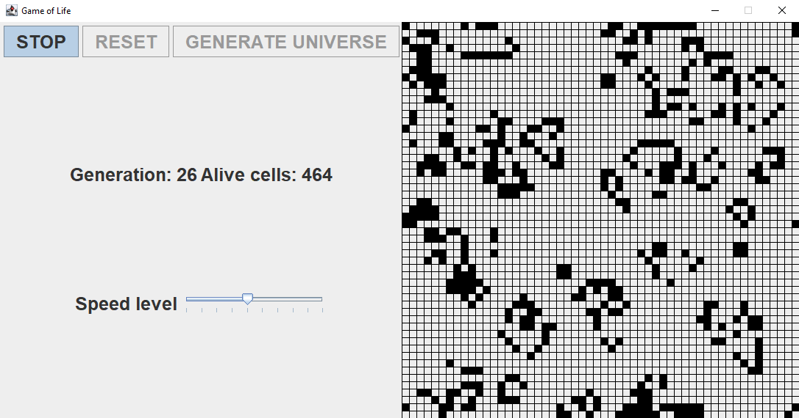
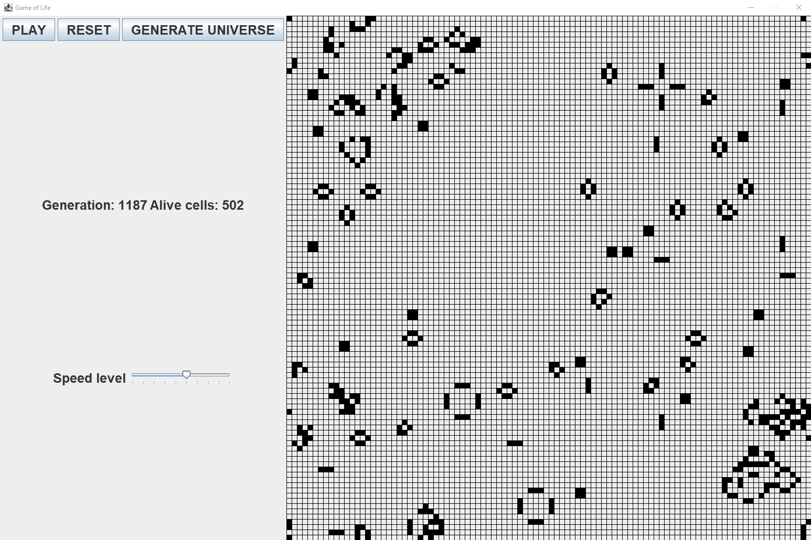

# Game of life

Java implementation of the John Conway's Game of Life using:
* OpenJDK 18
* Java Swing library
* Maven 3.8.1.

**Executable JAR is provided.**

### Wikipedia article about the game and its rules:
https://en.wikipedia.org/wiki/Conway%27s_Game_of_Life

### Features:
* Universe size range 25-100
* Pausing/Resetting evolution
* Generating new universe (based on new seed)
* Modifiable speed of evolution

Internally it is implemented using Model-View-Controller architecture.

# Tests
Unit tested using JUnit 5.9.0

# How to run
Run\
**java -jar executable/GameOfLife_Swing_Java.jar**

Minimum JRE 13 is required.
